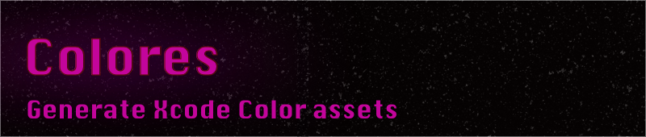

# colores


Generate Xcode color assets using the CommandLine &amp; JSON. Using Colores you can bulk add & set up default values for color assets in Xcode.
Adding colors in Xcode can sometimes be a terrible user experience especially now that there are many appearances to support. ¯\\\_(ツ)_/¯ 

Colores aims to improve this part of the development flow. 

## Features

Colores generates `.colorset`  folders for each color defined in a given compatible JSON file. See `demo.json` for formatting. 

Colores supports the following features:

- Create the same color for any appearance
- Create the same color for any locale
- Create the same color for any idiom
- Create the same color for high contrast
- Define a color space
- Basic sketch support

## Usage

### Simple JSON file

Clone the repository and build the source code.  Alternatively you can use the provided executable. (Found in the `Product` folder)

Check out the `demo.json` file to see how you can define your colors in a JSON format that `Colores` supports.

Once you've declared all your  colors use the following command on in your terminal client:

```
./colores yourFile.json
```

This will generate a temporay folder & decode all the colors defined in the `demo.json` file.

### Sketch SharedLayer Styles

This will generate a temporay folder and decode all the defined shared layer styles in your sketch file. These will be ready to be dropped into your `Assets.xcasset` folder. 

```
./colores --sketch path/to/your/unizpped/sketch/folder
```

#### Alternative

```
./colores -s path/to/your/unizpped/sketch/folder
```

## Configuration

The following JSON object shows which keys are currently supported. 

In a future version it shall be possible to set certain color specific attributes per color.

```json
{
    "appearances": ["dark", "light", "high"],
    "idioms": ["universal"],
    "colorSpace": "srgb",
    "locale": "en",
    "colors": {
        "primaryBackground": ["#1f212b","1.000"],
        "secondaryBackground": ["#ffffff","1.000"],
    }
}
```

## What's on the roadmap... 🚀
- [x] Add dark mode support
- [x] Add support for idioms
- [x] Add support for locales
- [x] Add basic support for sketch
- [ ] Tests
- [ ] Documentation
- [ ] Add support for custom ouputs
- [ ] Add support to add color sets to the asset folder
- [ ] Add support for CommandLine arguments
- [ ] Add support to define a color for a given appearance
- [ ] Add advanced support for sketch
